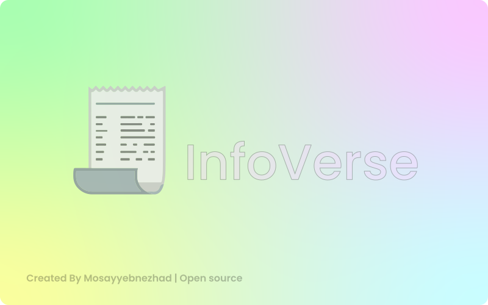

# infoverse
InfoVerse is a modern and updated encyclopedia that allows you to easily access a vast range of information and knowledge across various fields. With its innovative design and user-friendly interface, InfoVerse offers an engaging and straightforward experience for searching and exploring content. Our goal is to provide a reliable and trustworthy resource of knowledge that helps users find and utilize the information they need with greater confidence.



This is a sample portfolio website built using Next.js.

## Table of Contents

- [Demo](#demo)
- [Features](#features)
- [Installation](#installation)
- [Usage](#usage)
- [Technologies Used](#technologies-used)
- [Contributing](#contributing)
- [License](#license)
- [Contact](#contact)

## Demo

You can check out the live demo of the website [here](https://infoverse-msy.vercel.app).

## Features

- Responsive design
- Projects showcase
- Skills display
- Contact form
- Clean and modern UI

## Installation

To get a local copy up and running follow these simple steps:

1. **Clone the repository**

```bash
- git clone https://github.com/mosayyebnezhad/infoverse

- npm i
```
